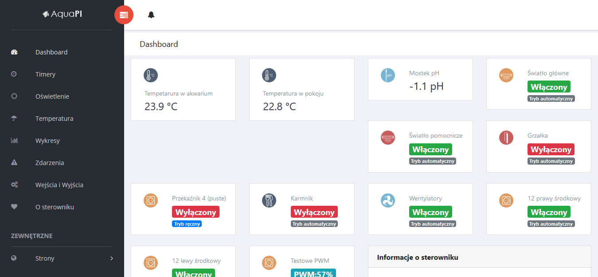

# AquaPi

The aim of this project is to build Raspberry Pi controlled platform for aquarium management.

## Table of contents
* [General info](#general-info)
* [Screenshots](#screenshots)
* [Versions](#Versions)
* [Setup](#setup)
* [Features](#features)
* [Status](#status)
* [Inspiration](#inspiration)
* [Contact](#contact)

## General info
This project is licensed using GPL 2.0 version.
It's combination of hardware layer and software as well.
Structure of directories is following:

* Software - source codes of daemon and php web ui.
* Hardware - all hardware designs (created using free version of Eagle).
* Doc      - place for documentation.

You can like it or not, but software is written (and documentation as well) in Polish language.

## Screenshots

## Versions
* Version 1.0 - still one and only stable version that was released.
* Version 2.0 - aka still in development phase - far more advanced than previous one, but also still not finished (but quite stable).

## Setup
Please see Doc directory if you wish to learn more about setup process.

## Features
List of features ready:
* Heating/cooling tank with different temperature settings between night and day.
* Light control with PWM usage to simulate sunrise/dawn.
* Recording of statistical data collected from sensors into database, and visualization on charts.
* Can be controlled using web browser, both on PC and mobile phone.
* Outputs controlled with timers with 1 second accuracy (nice for DIY feeders or fertilizers).

TODOs for future development:
* still some stuff to do with CO&#8322;.
* and probably more small staff to do.

## Status
Project is: in progress.

## Inspiration
This project was inspired by [Aquamat](https://github.com/musashimm/aquamat). 

## Contact
Created by [lexx](mailto:lexx@polarnet.pl) (http://lexx.polarnet.pl/) - feel free to contact me!